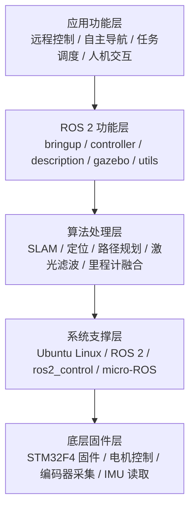
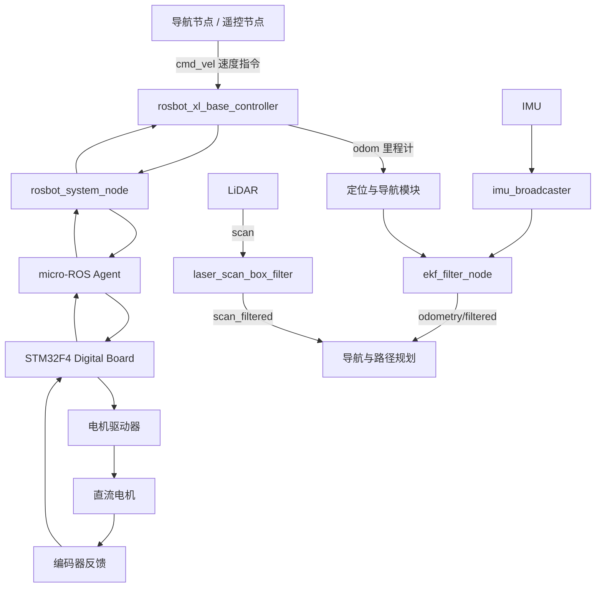

# ROSbot XL 软件系统分析说明

## 1. 文件用途

本文档用于整理《基于 ROSbot XL 的室内自主移动机器人嵌入式系统解决方案分析》报告中的软件系统部分。

本文件不是 ROSbot XL 的安装教程，而是为了辅助完成课程报告中的“软件系统设计”章节。后续可根据本文档内容生成 `chap7.md`，作为报告第七章“软件系统设计”的基础材料。

软件部分的写作重点是：

1. ROSbot XL 的软件系统如何分层；
2. ROS 2 在系统中承担什么作用；
3. 各 ROS 2 软件包分别负责什么功能；
4. 软件如何连接上位计算平台 SBC 与底层 STM32F4 控制板；
5. 传感器数据、运动控制指令和里程计信息如何在 ROS 2 系统中流动；
6. 软件系统如何支撑自主移动、建图、定位、控制和仿真。

---

## 2. 资料来源说明

本软件分析主要基于 Husarion 提供的 ROSbot XL ROS 2 软件资料，重点参考：

1. `husarion/rosbot_xl_ros` 仓库；
2. 仓库中的 `README.md`；
3. 仓库中的 `ROS_API.md`；
4. ROSbot XL 官方手册中关于硬件与软件架构的说明；
5. ROS 2、ros2_control、micro-ROS、robot_localization、laser_filters 等相关软件框架的基本功能。

需要注意的是，`rosbot_xl_ros` 仓库已经归档，不再作为最新维护版本。报告中可以将其作为 ROSbot XL 软件结构和 ROS API 的分析依据，但如果涉及最新开发状态，应说明后续开发已迁移到新的 `rosbot_ros` 仓库。

---

## 3. 软件系统总体定位

ROSbot XL 的软件系统可以理解为运行在 SBC 上的机器人上层软件系统。SBC 通常运行 Ubuntu Linux，并在其上运行 ROS 2 软件框架。ROS 2 负责组织机器人中的各类软件节点，使导航、定位、传感器处理、底盘控制、状态反馈和仿真等功能能够协同工作。

从嵌入式系统角度看，ROSbot XL 的软件系统并不是孤立存在的，而是与硬件系统紧密配合：

* SBC 运行 Linux 和 ROS 2；
* STM32F4 控制板运行底层固件；
* ROS 2 通过 micro-ROS 或硬件接口与底层控制板通信；
* 上层软件发布速度指令；
* 底层控制板驱动电机并采集编码器、IMU 等数据；
* 底层状态再反馈给 ROS 2，用于里程计、定位和导航。

因此，ROSbot XL 软件系统体现了“上位智能决策 + 底层实时控制”的典型机器人软件架构。

---

## 4. 软件系统分层结构

ROSbot XL 的软件系统可以划分为五个层次：



各层作用如下：

| 软件层次      | 主要内容                                             | 作用               |
| --------- | ------------------------------------------------ | ---------------- |
| 应用功能层     | 自主导航、远程控制、任务调度、人机交互                              | 面向用户和应用场景        |
| ROS 2 功能层 | bringup、controller、description、gazebo、utils 等软件包 | 组织 ROS 2 节点和功能模块 |
| 算法处理层     | 定位、里程计融合、路径规划、激光滤波等                              | 实现机器人感知、定位和运动规划  |
| 系统支撑层     | Ubuntu Linux、ROS 2、ros2_control、micro-ROS        | 提供操作系统、通信和控制框架   |
| 底层固件层     | STM32F4 固件、电机控制、编码器采集、IMU 读取                     | 执行底层实时控制任务       |

---

## 5. ROSbot XL 软件包组成

ROSbot XL 的 ROS 2 软件系统由多个软件包组成。各软件包分工如下：

| 软件包                     | 功能定位                                                                | 报告中的分析角度                          |
| ----------------------- | ------------------------------------------------------------------- | --------------------------------- |
| `rosbot_xl`             | 元包，管理 ROSbot XL 相关依赖                                                | 可理解为整个软件系统的入口包                    |
| `rosbot_xl_bringup`     | 启动真实机器人基础功能，包含 micro-ROS agent、robot_localization、laser_filters 等配置 | 用于说明机器人启动、传感器处理和底层通信的组织方式         |
| `rosbot_xl_controller`  | ROS 2 硬件控制器，管理 ros2_control 输入输出，并将数据转发给 micro-ROS                  | 用于说明 ROS 2 控制框架如何连接底层 STM32F4 控制板 |
| `rosbot_xl_description` | 机器人 URDF 模型，用于仿真和物理机器人坐标变换                                          | 用于说明机器人模型、坐标系和 TF 关系              |
| `rosbot_xl_gazebo`      | Gazebo 仿真相关启动文件                                                     | 用于说明仿真环境中的软件验证                    |
| `rosbot_xl_utils`       | 工具包，包含稳定固件版本和烧录脚本                                                   | 用于说明固件更新和系统维护                     |

这些软件包共同构成 ROSbot XL 的上层软件系统。其中，`bringup` 负责启动真实机器人所需的基础功能，`controller` 负责底盘控制相关的软件接口，`description` 负责机器人模型描述，`gazebo` 负责仿真，`utils` 负责固件维护。

---

## 6. 主要 ROS 2 节点分析

ROSbot XL 软件系统中包含多个关键 ROS 2 节点。报告中不需要逐个展开所有节点，只需要选取与嵌入式系统结构关系最密切的节点进行分析。

| 节点                          | 主要作用                            | 对应的系统功能              |
| --------------------------- | ------------------------------- | -------------------- |
| `controller_manager`        | 管理控制器和硬件接口，负责加载、激活和管理控制器        | 控制框架管理               |
| `ekf_filter_node`           | 融合轮式里程计和 IMU 数据                 | 状态估计与定位              |
| `imu_broadcaster`           | 发布 IMU 传感器数据                    | 姿态感知                 |
| `imu_sensor_node`           | 从硬件侧接收 IMU 数据                   | 传感器数据接入              |
| `joint_state_broadcaster`   | 发布机器人关节状态                       | 轮子状态与运动反馈            |
| `robot_state_publisher`     | 根据 URDF 和关节状态发布 TF 坐标变换         | 机器人模型与坐标变换           |
| `rosbot_system_node`        | 与硬件通信，负责电机控制相关数据收发              | ROS 2 与底层硬件连接        |
| `rosbot_xl_base_controller` | 将机器人速度指令转换为轮子控制指令，并根据硬件反馈计算里程计  | 底盘运动控制               |
| `laser_scan_box_filter`     | 过滤激光扫描中机器人自身 footprint 内部的点     | 激光雷达数据预处理            |
| `/stm32_node`               | 通过 micro-ROS 与 Digital Board 通信 | SBC 与 STM32F4 软件通信桥梁 |

这些节点共同完成从上层控制指令到硬件执行、从传感器采集到状态估计的完整软件流程。

---

## 7. 主要 ROS 2 话题分析

ROS 2 话题是软件模块之间交换数据的主要方式。ROSbot XL 中比较重要的话题如下：

| 话题                                 | 消息内容        | 作用              |
| ---------------------------------- | ----------- | --------------- |
| `~/cmd_vel`                        | 机器人速度指令     | 用于控制机器人运动       |
| `/battery_state`                   | 电池状态信息      | 用于电源状态监测        |
| `/diagnostics`                     | 诊断信息        | 用于系统状态检测和故障分析   |
| `~/imu_broadcaster/imu`            | IMU 数据      | 用于姿态估计和运动状态分析   |
| `~/joint_states`                   | 关节状态        | 用于描述轮子或关节状态     |
| `~/odometry/filtered`              | 融合后的里程计     | 用于定位和导航         |
| `~/rosbot_xl_base_controller/odom` | 底盘控制器计算的里程计 | 用于反馈机器人运动状态     |
| `~/scan`                           | 原始激光雷达扫描数据  | 用于环境感知          |
| `~/scan_filtered`                  | 过滤后的激光雷达数据  | 用于 SLAM、导航和避障   |
| `~/tf`                             | 动态坐标变换      | 描述机器人坐标系之间的动态关系 |
| `~/tf_static`                      | 静态坐标变换      | 描述固定坐标系之间的关系    |
| `/_motors_cmd`                     | 各轮期望速度      | 用于底层电机控制        |
| `/_motors_responses`               | 各轮反馈状态      | 用于运动反馈和里程计计算    |

在报告中，可以重点分析 `cmd_vel`、`odom`、`imu`、`scan`、`scan_filtered` 和 `tf`，因为这些话题最能体现机器人“感知—决策—控制—反馈”的软件闭环。

---

## 8. 软件数据流分析

ROSbot XL 的软件数据流可以分成两条主线：

1. 控制指令流；
2. 传感器反馈流。

控制指令流表示机器人如何从上层导航或遥控指令转化为底层电机动作；传感器反馈流表示底层硬件和传感器数据如何返回 ROS 2 系统，用于状态估计和后续导航。



该数据流体现了 ROSbot XL 软件系统的闭环控制思想：

* 上层软件产生速度指令；
* 控制器将速度指令转换为轮子控制目标；
* 底层 STM32F4 控制电机运动；
* 编码器和 IMU 返回状态数据；
* ROS 2 系统根据反馈更新里程计和定位；
* 导航模块根据新的状态继续规划路径。

---

## 9. 运动控制软件流程

ROSbot XL 的运动控制流程以 `cmd_vel` 速度指令为入口。上层导航节点或遥控节点发布机器人线速度和角速度，底盘控制器接收该速度指令后，根据底盘结构将其转换为各车轮的目标速度。

随后，控制相关数据经由 `rosbot_system_node` 和 micro-ROS 通信链路发送至底层 Digital Board。底层 STM32F4 固件根据目标速度控制电机驱动器，使机器人完成前进、后退、转向等动作。电机编码器采集轮速和位移信息，再将反馈数据返回 ROS 2 系统，用于计算里程计并更新机器人状态。

这一流程说明，ROSbot XL 的运动控制并不是由 ROS 2 单独完成，也不是由 STM32F4 单独完成，而是由 SBC 上的 ROS 2 软件与 STM32F4 底层固件协同完成。

---

## 10. 感知与定位软件流程

ROSbot XL 的感知与定位软件主要依赖编码器、IMU 和可扩展的 LiDAR 等传感器。

编码器反馈经过底层控制板处理后，可用于计算轮式里程计；IMU 数据通过 IMU 相关节点发布，用于补充机器人角速度、加速度和姿态变化信息；`ekf_filter_node` 对轮式里程计和 IMU 数据进行融合，得到更加稳定的机器人运动状态估计。

如果系统扩展 LiDAR，则激光雷达原始数据通过 `/scan` 话题发布。激光扫描数据经过滤波处理后形成 `/scan_filtered` 话题，可供 SLAM、导航和避障模块使用。这样，机器人能够结合自身运动状态和外部环境信息，实现室内自主移动。

---

## 11. 仿真与调试软件

ROSbot XL 软件系统支持真实机器人运行和 Gazebo 仿真两类模式。

真实机器人运行时，通常通过 bringup 启动文件启动机器人基础功能，包括底层通信、传感器处理和运动控制相关节点。仿真模式下，可以通过 Gazebo 启动机器人模型和传感器模型，在没有真实硬件的情况下测试运动控制、传感器处理和导航算法。

仿真与真实机器人运行之间的关系如下：

| 模式        | 作用               | 适用场景             |
| --------- | ---------------- | ---------------- |
| 真实机器人运行   | 控制实际硬件，读取真实传感器数据 | 硬件测试、实验演示、真实移动任务 |
| Gazebo 仿真 | 在虚拟环境中模拟机器人和传感器  | 算法验证、导航测试、软件调试   |

仿真功能对于机器人开发很重要，因为它可以在不损坏真实硬件的情况下测试程序逻辑，提高开发效率和安全性。

---

## 12. 软件系统特点分析

### 12.1 分层清晰

ROSbot XL 软件系统将应用功能、ROS 2 控制框架、传感器处理、底层通信和 STM32F4 固件分层组织，使软件结构较为清晰，便于维护和扩展。

### 12.2 与硬件结构对应明确

软件系统与硬件系统具有明显对应关系。SBC 运行 ROS 2，Digital Board 运行 STM32F4 固件；ROS 2 中的控制器、传感器节点和硬件接口节点对应硬件中的电机、编码器、IMU 和底层控制板。

### 12.3 支持闭环控制

软件系统通过 `cmd_vel`、电机控制、编码器反馈、里程计计算和状态融合形成闭环。这样机器人能够根据反馈修正运动状态，提高运动控制稳定性。

### 12.4 支持仿真和真实硬件

ROSbot XL 软件既支持真实机器人运行，也支持 Gazebo 仿真。这有助于在实验前进行算法验证，也便于教学和科研开发。

### 12.5 可扩展性较强

软件系统支持 LiDAR、深度相机、机械臂等扩展模块。通过 URDF、ROS 2 节点、话题和控制器配置，可以对机器人功能进行扩展。

---

## 13. 报告第七章建议目录

后续可根据本文档生成报告第七章，建议目录如下：

```text
第七章 软件系统设计

7.1 软件系统总体架构
7.2 操作系统与 ROS 2 软件框架
7.3 ROSbot XL 软件包组成
7.4 主要 ROS 2 节点分析
7.5 ROS 2 话题与数据流分析
7.6 运动控制软件流程
7.7 感知与定位软件流程
7.8 仿真与调试软件
7.9 软件系统特点分析
7.10 本章小结
```

---

## 14. 可直接用于报告的小结文字

ROSbot XL 的软件系统以 Ubuntu Linux 和 ROS 2 为核心，运行在上位计算平台 SBC 上。ROS 2 软件系统通过 bringup、controller、description、gazebo 和 utils 等软件包组织机器人启动、控制、建模、仿真和维护功能。其中，底盘控制器负责接收速度指令并生成轮子控制目标，传感器相关节点负责发布 IMU、编码器、LiDAR 等数据，状态估计节点负责融合轮式里程计和 IMU 信息，仿真软件则用于在 Gazebo 环境中验证机器人模型和控制算法。

该软件系统与硬件系统形成紧密配合：SBC 负责运行 Linux 和 ROS 2，完成高层软件功能；STM32F4 控制板负责底层实时控制，执行电机控制、编码器采集和传感器读取。二者通过通信链路交换速度指令、里程计和状态信息，从而形成“高层软件决策—底层硬件执行—传感器反馈—状态更新”的闭环控制过程。该结构体现了移动机器人嵌入式系统中软硬件协同设计的特点。
