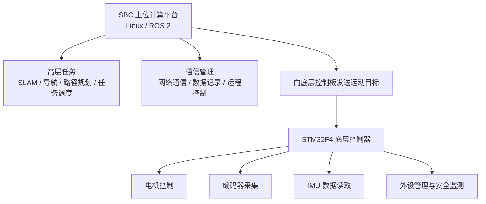
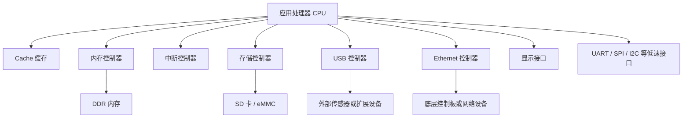
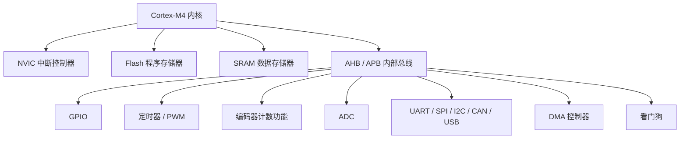
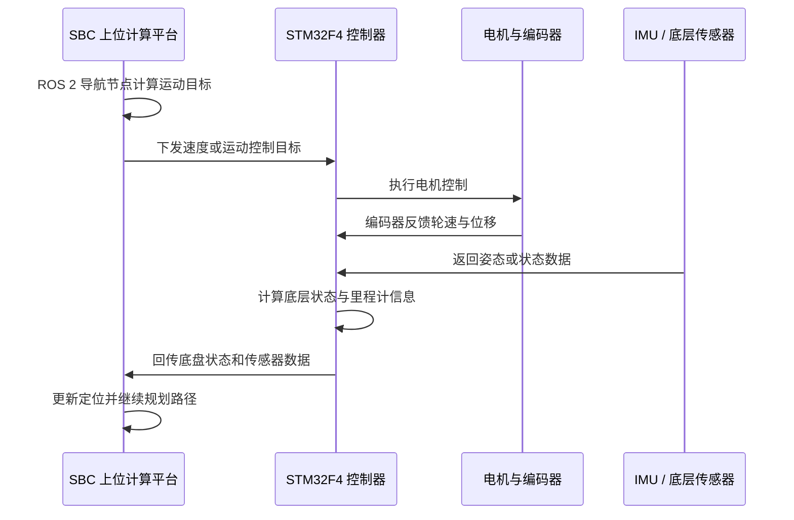

IN CHAPTER 5,I WILL INTRODUCE THE EMBEDDED PROFESSOR VIVIDLY，SO IN THE OTHER CHATRES ，IT SHOULD BE MENTIONED JUST SIMPLY。

# 第五章 嵌入式处理器分析

## 5.1 处理器总体架构

ROSbot XL 的嵌入式处理系统可以理解为“上位计算平台 + 底层实时控制器”的双处理器协同架构。系统中主要涉及两类嵌入式处理器：一类是作为上位计算平台的 SBC（Single Board Computer，单板计算机），另一类是 Digital Board 上的 STM32F4 微控制器。

其中，SBC 负责运行 Linux 操作系统和 ROS 2 机器人软件框架，主要承担导航、建图、路径规划、任务调度、远程通信等高层计算任务；STM32F4 微控制器负责底层实时控制，主要承担电机控制、编码器采集、IMU 数据读取、底层外设管理和安全监测等任务。

这种双处理器架构将复杂计算任务与实时控制任务分离，使系统既具备较强的高层智能计算能力，又能保证底层运动控制的实时性和可靠性。

整体处理器分工如下表所示。

| 处理器模块       | 类型              | 主要任务                               | 运行环境                 |
| ----------- | --------------- | ---------------------------------- | -------------------- |
| SBC 上位计算平台  | 单板计算机 / 应用处理器平台 | Linux、ROS 2、SLAM、导航、路径规划、任务调度、网络通信 | Ubuntu Linux / ROS 2 |
| STM32F4 控制板 | 微控制器 MCU        | 电机控制、编码器采集、IMU 读取、外设控制、安全监测        | 裸机程序或 RTOS 固件        |

可以将 SBC 理解为机器人系统中的“大脑”，负责判断机器人应该如何运动；将 STM32F4 理解为机器人系统中的“底层神经系统”，负责把高层指令转换为具体的电机控制和状态反馈。

## 5.2 SBC 上位计算平台分析

### 5.2.1 SBC 的系统作用

SBC 是 Single Board Computer 的缩写，即单板计算机。在 ROSbot XL 中，SBC 是机器人系统的上位计算平台，主要负责运行操作系统和机器人应用软件。与底层 MCU 相比，SBC 的计算能力更强，能够运行 Linux、ROS 2、导航算法、建图算法和多任务应用程序。

SBC 在系统中的主要作用包括：

1. 运行 Ubuntu Linux 等通用操作系统；
2. 运行 ROS 2 机器人软件框架；
3. 接收并处理 LiDAR、深度相机等传感器数据；
4. 完成 SLAM 建图、定位、路径规划和局部避障；
5. 管理机器人任务状态，例如导航目标、远程控制、日志记录等；
6. 与底层 STM32F4 控制板进行数据交换；
7. 为机器人上层应用提供计算、通信和存储能力。

因此，SBC 主要负责“高层智能计算”，而不是直接完成底层电机驱动。

### 5.2.2 SBC 的典型处理器平台

ROSbot XL 可根据配置采用不同类型的 SBC，例如 Raspberry Pi、NVIDIA Jetson 或 Intel NUC。不同 SBC 的处理器架构和性能有所不同，但它们在机器人系统中的作用基本一致，都是承担上位计算任务。

为了便于分析，本文以 Raspberry Pi 4B 作为典型 SBC 示例。Raspberry Pi 4B 采用 Broadcom BCM2711 处理器，其 CPU 部分为四核 ARM Cortex-A72。该处理器属于 ARM Cortex-A 系列应用处理器，适合运行 Linux 等复杂操作系统。

需要说明的是，SBC 并不是某一种固定处理器，而是一类单板计算机平台。现代机器人中常用的 SBC 通常采用多核应用处理器，以满足 Linux、ROS 2、SLAM、路径规划和多任务调度等需求。若实际系统采用 NVIDIA Jetson 或 Intel NUC，也可以按照相同思路分析，只是处理器架构和计算性能不同。

### 5.2.3 SBC 内部结构分析

SBC 的内部结构通常包括应用处理器 CPU、内存系统、存储系统、外设控制器、网络控制器和显示接口等部分。其内部结构可以抽象如下：

其中，CPU 负责执行 Linux 内核、ROS 2 节点和机器人应用程序；Cache 缓存用于提高指令和数据访问速度；DDR 内存用于存放操作系统、程序代码、传感器数据和地图数据；存储控制器用于连接 SD 卡或 eMMC，保存系统镜像、配置文件、地图和日志；USB、Ethernet 等外设控制器用于连接外部传感器、网络设备或底层控制板。

从嵌入式系统角度看，SBC 的特点是计算能力强、接口丰富、可运行复杂操作系统，适合承担机器人系统的上位智能任务。

### 5.2.4 Cortex-A 系列内核与指令集架构

以 Raspberry Pi 4B 为例，其 CPU 采用 ARM Cortex-A72 内核。Cortex-A72 属于 ARM Cortex-A 系列处理器，面向高性能应用处理场景，支持 ARMv8-A 指令集架构。ARMv8-A 支持 64 位 AArch64 执行状态，同时也可以兼容 32 位 AArch32 执行状态。

Cortex-A 系列处理器与 Cortex-M 系列微控制器相比，主要区别在于：

1. Cortex-A 处理器性能更强，适合运行 Linux 等复杂操作系统；
2. Cortex-A 处理器通常带有 MMU，可支持虚拟内存和多进程操作系统；
3. Cortex-A 处理器通常具有多级 Cache，有利于提升复杂程序运行效率；
4. Cortex-A 处理器适合处理图像、点云、导航、路径规划等高层任务；
5. Cortex-A 处理器实时性通常不如 MCU，因此不适合直接承担高精度电机闭环控制。

在 ROSbot XL 中，SBC 上的 Cortex-A 系列处理器主要用于运行 ROS 2 节点。例如，SLAM 节点需要处理传感器数据并生成地图，导航节点需要根据地图和目标点规划路径，控制节点则需要将规划结果转换为速度指令并发送给底层控制器。

### 5.2.5 SBC 的外设能力说明

SBC 通常具有 USB、Ethernet、Wi-Fi、HDMI、GPIO、UART、SPI、I2C 等外设能力。这些接口能力使其能够连接传感器、网络设备、显示设备和底层控制器。

但在本章中，对这些接口只作能力层面的说明，不展开具体系统连接关系。具体的模块连接方式、传输内容和设计原因将在后续“系统接口分析”章节中专门讨论。

SBC 的外设能力可以概括如下：

| 外设能力             | 在机器人系统中的作用                    |
| ---------------- | ----------------------------- |
| USB              | 连接 LiDAR、深度相机、USB Hub 或其他外部设备 |
| Ethernet         | 连接底层控制板、局域网或调试设备              |
| Wi-Fi            | 用于远程控制、软件更新和网络通信              |
| HDMI / DSI       | 用于显示调试界面或人机交互界面               |
| UART / SPI / I2C | 可用于连接低速外设或扩展模块                |
| 存储接口             | 保存操作系统、地图、日志和配置文件             |

由此可见，SBC 的接口能力服务于高层计算和外部扩展，但其核心作用仍然是运行 Linux 和 ROS 2，实现机器人上层功能。

## 5.3 STM32F4 底层控制处理器分析

### 5.3.1 STM32F4 的系统作用

STM32F4 是 ROSbot XL 底层 Digital Board 的核心微控制器。与 SBC 相比，STM32F4 的计算能力较弱，但实时性更强，外设资源更适合底层控制任务。

在移动机器人中，底层控制任务通常具有较高实时性。例如，电机速度控制需要按照固定周期执行，编码器脉冲需要及时采集，异常状态需要快速响应。如果这些任务全部交给运行 Linux 的 SBC，可能会受到操作系统调度延迟影响。因此，ROSbot XL 采用 STM32F4 作为底层控制器是合理的。

STM32F4 在系统中的主要作用包括：

1. 接收 SBC 下发的运动控制目标；
2. 根据控制目标生成电机控制信号；
3. 采集电机编码器反馈；
4. 读取 IMU 等底层传感器数据；
5. 控制 RGB 指示灯、扬声器等外设；
6. 监测底层硬件状态；
7. 在异常情况下执行安全保护。

因此，STM32F4 主要负责“实时控制和底层执行”。

### 5.3.2 STM32F4 内部结构分析

STM32F4 系列微控制器内部集成了 Cortex-M4 内核、Flash、SRAM、中断控制器、定时器、GPIO、通信接口、DMA、看门狗等组件。这些组件共同构成了底层控制系统的硬件基础。

其内部结构可以抽象如下：

各内部组件的作用如下：

| 内部组件                         | 作用                   |
| ---------------------------- | -------------------- |
| Cortex-M4 内核                 | 执行底层控制程序，是 MCU 的计算核心 |
| Flash                        | 存储固件程序               |
| SRAM                         | 保存运行时变量、控制参数和缓存数据    |
| NVIC 中断控制器                   | 管理外部中断、定时器中断和通信中断    |
| AHB / APB 总线                 | 连接内核、存储器和片上外设        |
| 定时器 / PWM                    | 产生控制周期和电机控制信号        |
| GPIO                         | 控制或读取简单数字信号          |
| 编码器计数功能                      | 读取电机编码器脉冲，计算速度和位移    |
| ADC                          | 采集模拟量信号，如电压、电流等      |
| UART / SPI / I2C / CAN / USB | 与外部模块通信              |
| DMA                          | 在数据搬运时减少 CPU 占用      |
| 看门狗                          | 在程序异常时自动复位，提高系统可靠性   |

这些内部组件使 STM32F4 能够完成移动机器人底层实时控制任务。

### 5.3.3 Cortex-M4 内核与指令集架构

STM32F4 采用 ARM Cortex-M4 内核。Cortex-M4 面向嵌入式实时控制场景，支持 ARMv7E-M 架构和 Thumb-2 指令集，并带有 DSP 扩展指令。部分 STM32F4 器件还支持单精度浮点运算单元 FPU。

Cortex-M4 的主要特点包括：

1. 实时性较强，中断响应速度快；
2. 功耗较低，适合电池供电设备；
3. 外设资源丰富，适合电机控制和传感器采集；
4. Thumb-2 指令集代码密度较高，适合嵌入式存储资源有限的场景；
5. DSP 扩展有利于执行滤波、姿态估计、控制算法等计算任务；
6. NVIC 支持中断优先级管理，便于处理急停、安全保护等高优先级事件。

在 ROSbot XL 中，STM32F4 的实时控制能力是系统稳定运动的基础。它可以按照固定周期执行底层控制程序，及时读取编码器和 IMU 数据，并将底层状态反馈给上位计算平台。

### 5.3.4 STM32F4 内部组件与机器人任务的对应关系

STM32F4 的内部外设与移动机器人底层任务具有明确对应关系。如下表所示：

| 机器人底层任务 | 相关 STM32F4 内部组件                    | 说明                            |
| ------- | ---------------------------------- | ----------------------------- |
| 电机速度控制  | 定时器、PWM、GPIO                       | 定时器产生控制周期，PWM 或控制信号用于驱动电机控制模块 |
| 编码器采集   | 定时器编码器模式、中断                        | 采集电机旋转脉冲，用于速度反馈和里程计计算         |
| 姿态数据读取  | I2C / SPI / UART                   | 读取 IMU 的角速度、加速度等数据            |
| 状态监测    | GPIO、ADC、中断                        | 采集开关量、模拟量或异常信号                |
| 通信任务    | UART / CAN / USB / Ethernet 相关通信模块 | 与上位计算平台或其他模块交换数据              |
| 安全保护    | NVIC、GPIO、看门狗                      | 快速响应异常状态，提高系统可靠性              |
| 数据搬运    | DMA                                | 减少 CPU 在通信或采样过程中的数据搬运负担       |

本节只分析 STM32F4 内部组件与底层任务之间的对应关系，不展开具体外部模块的接口连接。具体接口连接将在后续章节分析。

## 5.4 SBC 与 STM32F4 的协同工作机制

ROSbot XL 的运动控制不是由单一处理器完成，而是由 SBC 和 STM32F4 协同完成。SBC 运行 ROS 2 和导航算法，计算机器人下一步应该执行的运动目标；STM32F4 接收目标后，完成底层电机控制和状态反馈。

典型工作流程如下：

该过程体现了“高层智能决策 + 底层实时执行”的设计思想。SBC 具有强计算能力，适合进行路径规划和多传感器数据处理；STM32F4 具有强实时性，适合进行电机控制和底层数据采集。二者分工明确，可以提高系统的稳定性和可维护性。

## 5.5 处理器内部接口与外设能力分析

本节分析处理器内部组件之间的接口关系，而不是分析系统中各硬件模块之间的具体连接。这样可以避免与后续“系统接口分析”章节重复。

### 5.5.1 SBC 内部接口关系

SBC 内部主要通过片上总线连接 CPU、内存控制器、存储控制器、USB 控制器、Ethernet 控制器和显示控制器等模块。CPU 运行 Linux 和 ROS 2 程序时，需要频繁访问内存、存储和外设数据，因此内部总线和内存系统对整体性能有较大影响。

在机器人应用中，SBC 内部接口主要服务于高吞吐量数据处理。例如，传感器数据进入 SBC 后，通常需要存入内存，再由 CPU 上运行的 ROS 2 节点进行处理。SLAM 和路径规划过程也需要频繁访问地图数据、传感器数据和机器人状态数据。

因此，SBC 内部接口的设计重点是高带宽、多任务支持和操作系统兼容性。

### 5.5.2 STM32F4 内部接口关系

STM32F4 内部通过 AHB、APB 等总线连接 Cortex-M4 内核、Flash、SRAM 和片上外设。Cortex-M4 内核通过内部总线访问外设寄存器，从而控制定时器、GPIO、通信接口和 DMA 等模块。

在底层控制中，STM32F4 内部接口更强调实时性和确定性。例如，定时器可以周期性触发中断，控制程序在中断中完成速度计算和控制输出；编码器输入可以由硬件计数器直接采集，减少软件轮询开销；DMA 可以在通信或数据采样时减少 CPU 负担；NVIC 可以根据中断优先级快速响应急停或异常事件。

因此，STM32F4 内部接口的设计重点是低延迟、稳定性和可靠性。

## 5.6 处理器架构合理性分析

ROSbot XL 采用 SBC 与 STM32F4 分工协作的处理器架构，具有较强的工程合理性。

首先，SBC 能够运行 Linux 和 ROS 2，适合承担导航、建图、路径规划和远程通信等高层任务。这些任务计算量较大，软件生态复杂，需要操作系统、多线程、文件系统和网络协议栈支持。

其次，STM32F4 能够以较高实时性执行底层控制程序，适合完成电机控制、编码器采集和安全监测等任务。这些任务对响应时间和执行周期有较高要求，不适合完全依赖通用操作系统完成。

再次，双处理器分层结构提高了系统可靠性。当上位 SBC 出现计算负载过高或软件异常时，底层 STM32F4 仍可以执行基本安全控制，例如停止电机或进入保护状态。这样可以降低机器人失控风险。

最后，该架构具有较好的扩展性。若需要更强的视觉识别或 AI 计算能力，可以将 SBC 替换为 NVIDIA Jetson 或 Intel NUC；若需要增加底层传感器或执行器，可以通过 STM32F4 的外设资源进行扩展。

## 5.7 本章小结

本章对 ROSbot XL 的嵌入式处理器进行了分析。系统中的核心处理器包括上位计算平台 SBC 和底层 STM32F4 微控制器。SBC 主要负责运行 Linux 和 ROS 2，承担 SLAM、导航、路径规划、任务调度和网络通信等高层任务；STM32F4 主要负责底层实时控制，承担电机控制、编码器采集、IMU 数据读取、外设管理和安全监测等任务。

从处理器架构看，SBC 具有较强的计算能力和操作系统支持，适合复杂算法和多任务应用；STM32F4 具有较强的实时性和丰富的片上外设，适合底层控制和传感器采集。二者通过分层协作，使 ROSbot XL 同时具备高层智能计算能力和底层实时控制能力。

本章主要从处理器角度分析其内部结构、内核、指令集架构和外设能力。后续章节将进一步从系统连接角度分析 SBC、STM32F4、传感器、执行器和电源管理模块之间的接口关系。
